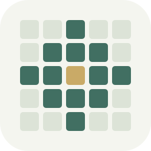
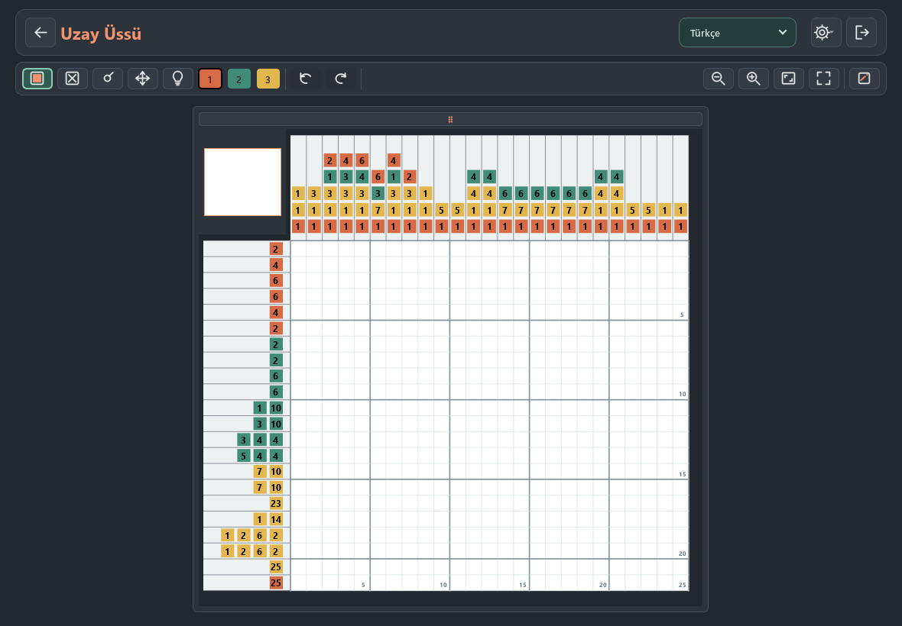
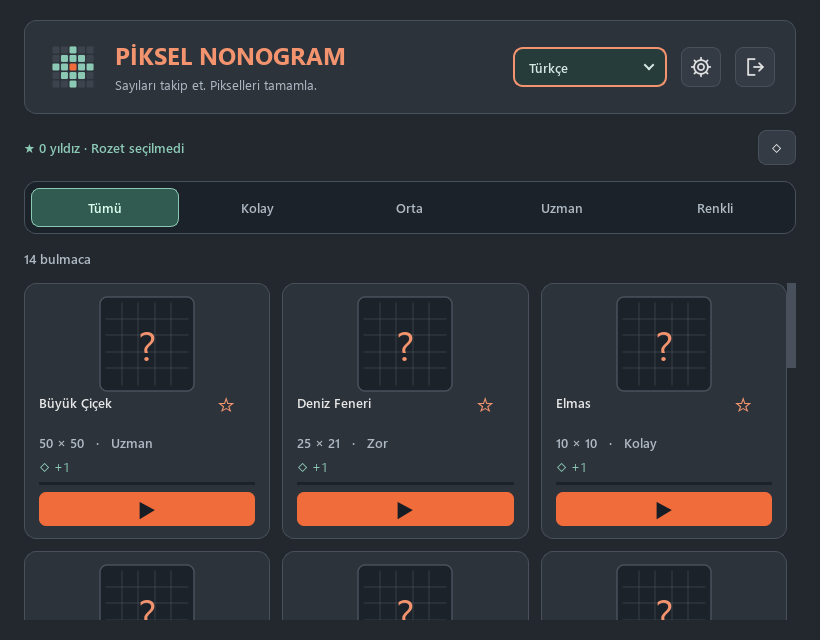
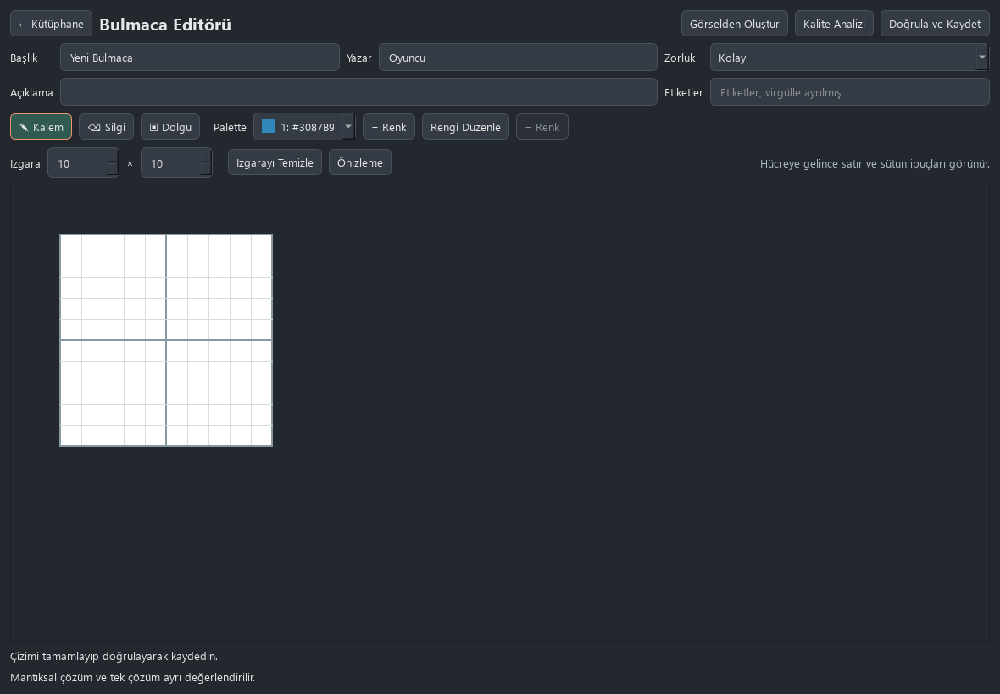
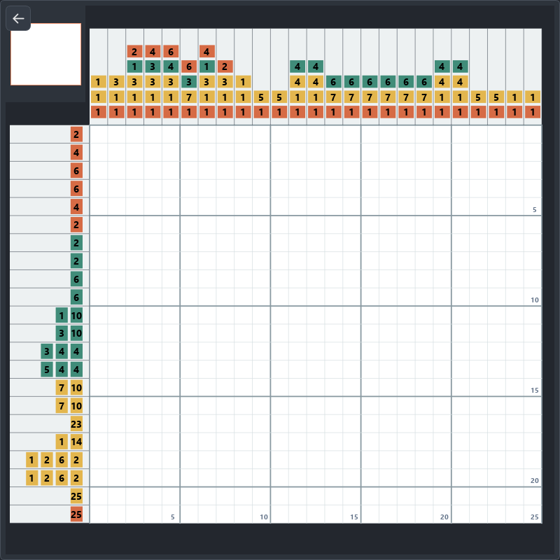
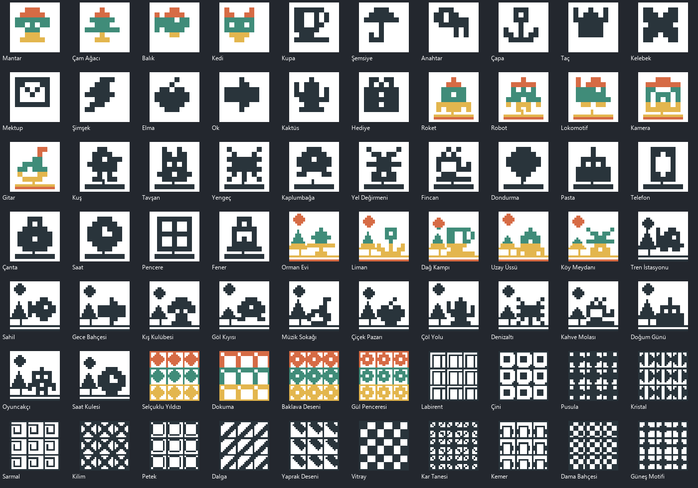

<div align="center">
  
  <h1>Piksel Nonogram</h1>
  <p><strong>Sayıları takip et. Pikselleri tamamla.</strong></p>
  <p>Çevrimdışı çalışan, renkli ve siyah beyaz bulmacalara sahip masaüstü nonogram oyunu.</p>
  <p>
    <a href="https://github.com/Teknoloji-Filozoflari/Pixel_Nonograms_Game/releases">⬇️ Linux sürümleri</a> ·
    <a href="#kurulum">Kurulum</a> ·
    <a href="#geliştirme">Geliştirme</a>
  </p>
  <p>
    
    
    
  </p>
</div>



## Oyunda neler var?

| | |
| --- | --- |
| 🧩 **1.000 bulmaca** | 800 siyah beyaz ve 200 renkli bulmaca; kolaydan uzmana farklı tahta boyutları. |
| 🎨 **Kendi bulmacanı oluştur** | Dahili editörle çiz, görselden içe aktar, çözümü analiz et ve kaydet. |
| 💡 **Yardımcı araçlar** | Satır ve sütun yardımı, alan ipuçları, işaretçiler ve geri alma. |
| 🌍 **Beş dil** | Türkçe, Azerbaycan Türkçesi, İngilizce, İspanyolca ve Rusça. |
| 💾 **Yerel ilerleme** | Bulmacalar ve kayıtlar çevrimdışı çalışır; ilerleme SQLite ile saklanır. |
| 🖥️ **Büyük tahtalara uygun** | Yakınlaştırma, kaydırma ve tam ekran tahta görünümü. |

<table>
  <tr>
    <td width="50%"><br><strong>Bulmaca kütüphanesi</strong></td>
    <td width="50%"><br><strong>Kendi çizimini oluştur</strong></td>
  </tr>
</table>

<details>
<summary>Daha fazla ekran görüntüsü</summary>





</details>

## Kurulum

**[v0.1.1 Linux paketlerini indir](https://github.com/Teknoloji-Filozoflari/Pixel_Nonograms_Game/releases/tag/v0.1.1).**

| Biçim | Hedef | Kurulum |
|---|---|---|
| AppImage | x86_64 Linux, glibc 2.36+ | Dosyaya çalıştırma izni verip aç |
| DEB | Debian 12/13 amd64 | `sudo apt install ./pixel-nonograms_0.1.1_amd64.deb` |
| RPM | Fedora 43 x86_64 | `sudo dnf install ./pixel-nonograms-0.1.1-1.fc43.x86_64.rpm` |
| Snap | snapd bulunan amd64 Linux | `sudo snap install --dangerous ./pixel-nonograms_0.1.1_amd64.snap` |
| Nix / NixOS | x86_64 Linux | `nix run github:Teknoloji-Filozoflari/Pixel_Nonograms_Game/v0.1.1` |
| Wheel / kaynak ZIP | Python 3.13+ | Sürüm sayfasından indir |

Paketler 1.000 bulmacayı ve beş dilin çevirilerini içerir. `SHA256SUMS.txt`
indirilen dosyaların bütünlüğünü kontrol etmek içindir. Snap Store, AUR ve
resmî Nixpkgs yayını yapılmamıştır; Snap dosyası GitHub'dan yerel kurulum içindir.

AppImage için:

```sh
chmod +x Pixel_Nonograms-*-x86_64.AppImage
./Pixel_Nonograms-*-x86_64.AppImage
```

Debian veya Pardus için:

```sh
sudo apt install ./pixel-nonograms_*_amd64.deb
```

Uygulama menüsünden **Piksel Nonogram**'ı açın. Paketler Python kurulumuna ihtiyaç duymaz. AppImage için FUSE bulunmayan sistemlerde `APPIMAGE_EXTRACT_AND_RUN=1 ./Pixel_Nonograms-*-x86_64.AppImage` kullanılabilir. Paketlerin hedefi Debian 12/13 ve Pardus 23/25 masaüstüdür; doğrudan Pardus cihaz testi henüz yapılmadı. Ayrıntılar: [Linux dağıtım rehberi](README_LINUX.md).

**Windows / kaynaktan çalıştırma:** Python 3.13 veya yeni sürüm kurun, ardından proje klasöründe:

```powershell
py -3.13 -m venv .venv
.\.venv\Scripts\python.exe -m pip install -e ".[dev]"
.\.venv\Scripts\python.exe -m pixel_nonograms
```

Linux'ta Python 3.13 ile `sh Oyunu_Baslat_Linux.sh` da kullanılabilir. İlk kurulumda bağımlılıkların indirilmesi gerekir; oyun çevrimdışı çalışır.

## Nasıl oynanır?

Satır ve sütun başındaki sayılar, o çizgide art arda boyanacak hücre gruplarını gösterir. Grupların arasında en az bir boş hücre bırakılır. İpuçlarını birleştirerek gizli resmi ortaya çıkarın. Renkli bulmacalarda önce paletten rengi seçin.

| Kontrol | İşlev |
| --- | --- |
| Sol tık / sürükle | Hücre boyama |
| Sağ tık / `X` | Boş hücre işaretleme |
| `B` | Boya aracına geçme |
| `F` / `R` | Tahtayı sığdırma / okunabilir yakınlaştırma |
| `F11` | Tahta tam ekranı |
| `Boşluk` + sürükle | Tahtayı kaydırma |

## Geliştirme

Kaynak kod `src/pixel_nonograms` altında; testler `tests` içinde. Python 3.13+ ortamında:

```sh
python -m venv .venv
.venv/bin/python -m pip install -e ".[dev]"
.venv/bin/python -m pytest -q
.venv/bin/python -m ruff check src tests
.venv/bin/python -m pixel_nonograms
```

AppImage ve DEB Debian 12 tabanlı Docker ortamında üretilir. RPM Fedora 43,
Snap core24 ve Nix kaynak tabanlı ayrı iş akışlarını kullanır. Paket iş akışları
Actions üzerinden başlatılır; tüm kontroller başarılı olunca **Publish verified
Linux packages** dosyaları, kaynak arşivlerini ve ortak SHA-256 listesini yayımlar.
Yerel komutlar ve hedef sınırlamaları [README_LINUX.md](README_LINUX.md) içindedir.

Üçüncü taraf bileşenler ve bildirimler için [THIRD_PARTY_NOTICES.md](THIRD_PARTY_NOTICES.md) dosyasına bakın.
